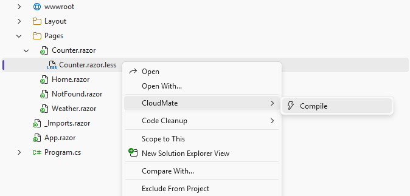
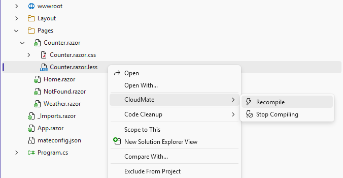
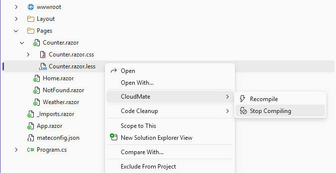
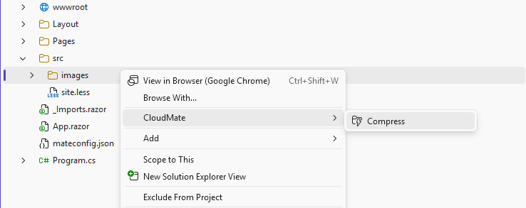
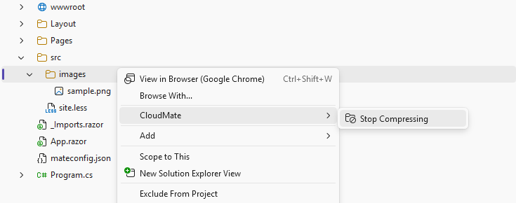
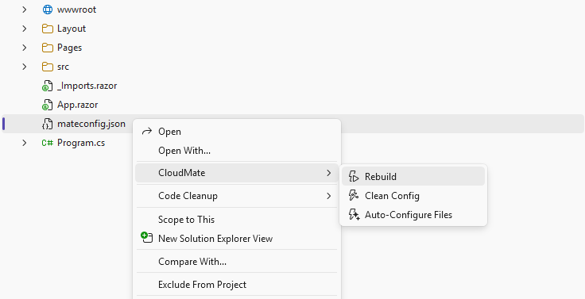
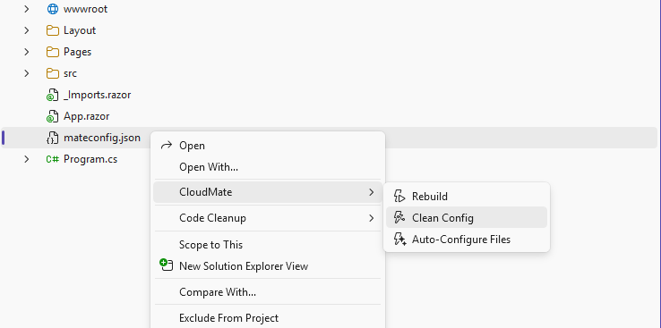
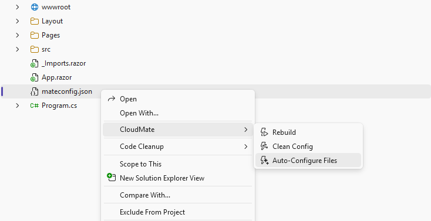
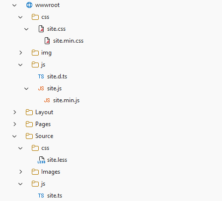

# CloudMate for Visual Studio
[](https://angrymonkeycloud.com/cloudmate)
[](https://github.com/angrymonkeycloud/CloudMate)
[](https://marketplace.visualstudio.com/items?itemName=AngryMonkey.CloudMate)
[](https://marketplace.visualstudio.com/items?itemName=AngryMonkey.CloudMate)
[](../LICENSE)


CloudMate integrates the `mate` CLI into Visual Studio for .NET solutions that include front-end/static assets.

## Best Use

CloudMate is best used in **.NET projects** where TypeScript/CSS pipelines and image optimization are managed alongside C# code.

## Prerequisites

Install the CloudMate CLI globally:

```bash
dotnet tool install -g AngryMonkey.CloudMate.CLI
```

## Features

### Bundler

- **TypeScript compilation** — compiles `.ts` files using the bundled TypeScript compiler; supports `tsconfig.json` auto-detection or explicit path
- **LESS compilation** — compiles `.less` files to CSS using the bundled Less.js engine
- **Sass / SCSS compilation** — compiles `.sass` and `.scss` files to CSS using the bundled Dart Sass engine
- **CSS passthrough & bundling** — concatenates plain `.css` files into a single output bundle
- **JavaScript passthrough & bundling** — concatenates plain `.js` files into a single output bundle
- **Minification** — produces `.min.css` and `.min.js` side-by-side with every bundle (configurable per build)
- **Source maps** — optional source map generation for both CSS and JavaScript outputs
- **TypeScript declaration files** — generates and bundles `.d.ts` declaration files alongside compiled JS output
- **WebClean transform** — strips CommonJS `require()`/`exports` artifacts from TypeScript output for direct browser use
- **Glob input patterns** — input lists support glob patterns; multiple inputs are resolved and concatenated in order
- **Multiple builds** — define named build profiles (`dev`, `dist`, etc.) each with their own output directory, minification, and source-map settings
- **Output directory versioning** — optionally append the package version or name segment to the output path (`OutDirVersioning`, `OutDirName`)
- **Per-output-type directory suffixes** — separate sub-folder suffixes for CSS and JS outputs within the same build (`OutDirSuffix`)

### Image Compression

- **Raster image compression** — re-encodes PNG, JPEG, GIF, and WebP images using SkiaSharp; keeps the original when re-encoding would increase the file size
- **SVG passthrough** — copies SVG files to the output directory without modification
- **Resize to max bounds** — optionally constrain images to a maximum width and/or height while preserving the aspect ratio (never enlarges)
- **Format conversion** — convert images to a different format (`png`, `jpg`, `jpeg`, `gif`, `webp`, `tiff`) via `OutputFormat`
- **Glob input patterns** — image input supports glob patterns for batch processing entire directories
- **Skip-if-exists** — already-compressed outputs are skipped on subsequent runs unless an override is requested

### File Watcher

- **Incremental rebuild on save** — watches all declared input files and re-runs only the affected bundle when a file changes
- **Implicit dependency tracking** — always watches all `.less` and `.scss` files under the project root so `@import` changes trigger the right rebuild
- **Config hot-reload** — detects changes to `mateconfig.json` and automatically restarts the watcher with the new configuration
- **Config deletion detection** — stops the watcher cleanly when `mateconfig.json` is deleted; no restart is attempted until the file is recreated
- **Image watch** — watches image input globs and re-compresses on add, change, or delete

### Configuration

Configuration is stored in `mateconfig.json` (or `mateconfig.yaml` / `mateconfig.yml`) at the project root. CloudMate writes `mateconfig.json` automatically when a command is first used.

**Supported config file names (searched in order):**
`mateconfig.json`, `mateconfig.yaml`, `mateconfig.yml`, `.mateconfig`, `.mateconfig.json`, `.mateconfig.yaml`, `.mateconfig.yml`, `package.json` *(via `mateconfig` key)*

**Example `mateconfig.json`:**

```json
{
  "builds": [
    {
      "name": "dev",
      "css": { "minify": true, "sourceMap": false },
      "js":  { "minify": true, "sourceMap": true, "declaration": true, "webClean": false }
    },
    {
      "name": "dist",
      "outDir": "wwwroot/dist",
      "outDirVersioning": true,
      "css": { "minify": true },
      "js":  { "minify": true, "webClean": true }
    }
  ],
  "files": [
    { "input": ["src/styles/**/*.less"], "output": ["wwwroot/css/site.css"], "builds": ["dev", "dist"] },
    { "input": ["src/scripts/app.ts"],   "output": ["wwwroot/js/app.js"],    "builds": ["dev", "dist"] }
  ],
  "images": [
    {
      "input":  ["src/images/**/*"],
      "output": ["wwwroot/images"],
      "maxWidth": 1920,
      "maxHeight": 1080,
      "outputFormat": "webp"
    }
  ]
}
```

## Context Menu Commands

All CloudMate commands appear in **Solution Explorer** under the **CloudMate** submenu when you right-click an item. Which commands are visible depends on the type of item selected and whether it is already registered in `mateconfig.json`.

---

### Compile — `.ts` `.js` `.css` `.less` `.scss` `.sass`

**Compile** is shown when the selected file is **not yet** registered in `mateconfig.json`.



What it does:
1. Creates `mateconfig.json` at the project root if it does not already exist.
2. Appends a `files` entry mapping the selected file as input to its compiled output path.
   - `.less` / `.scss` / `.sass` → output extension becomes `.css`
   - `.ts` → output extension becomes `.js`
   - `.js` / `.css` → extension is kept; file is passed through and bundled as-is
3. When the project is a .NET project (contains a `.csproj`) or has a `wwwroot` folder, and the file is inside `src/` or `source/`, the output is automatically placed under `wwwroot/` with the leading `src`/`source` segment stripped (e.g. `src/styles/site.less` → `wwwroot/styles/site.css`).
4. Runs a one-time compile using the current configuration.
5. Starts the always-on file watcher so subsequent saves recompile automatically.

---

### Recompile — `.ts` `.js` `.css` `.less` `.scss` `.sass`

**Recompile** replaces **Compile** on the same menu item when the selected file **is already** registered in `mateconfig.json`.



What it does:
1. Makes no changes to `mateconfig.json`.
2. Runs a one-time compile using the existing configuration.
3. Ensures the always-on watcher is running.

---

### Stop Compiling — `.ts` `.js` `.css` `.less` `.scss` `.sass`

**Stop Compiling** is shown alongside **Recompile** when the selected file **is already** registered in `mateconfig.json`.



What it does:
1. Removes all `files` entries in `mateconfig.json` whose `input` matches the selected file.
2. Runs a one-time build so the remaining entries in the config are still up to date.
3. Keeps the watcher running for any remaining configured files.

---

### Compress — folder

**Compress** is shown when a **folder** is selected and it is **not yet** registered in `mateconfig.json`.



What it does:
1. Creates `mateconfig.json` at the project root if it does not already exist.
2. Appends an `images` entry with a recursive glob (`folder/**/*`) as input.
   - When the project is a .NET project (contains a `.csproj`) or has a `wwwroot` folder, and the folder is inside `src/` or `source/`, the output destination is automatically remapped to the corresponding path under `wwwroot/` (e.g. `src/images` → `wwwroot/images`).
3. Runs a one-time image compression pass for all images found in the folder.
4. Starts the always-on watcher so new or changed images in the folder are recompressed automatically.

Supported image types: `png`, `jpg`, `jpeg`, `gif`, `webp`, `svg` (SVG is copied as-is).

---

### Stop Compressing — folder

**Stop Compressing** replaces **Compress** for folders that **are already** registered in `mateconfig.json`.



What it does:
1. Removes all `images` entries in `mateconfig.json` whose `input` matches the selected folder glob.
2. Runs a one-time build so any remaining config entries stay up to date.
3. Keeps the watcher running for any remaining configured entries.

---

### Rebuild — `mateconfig.json`

**Rebuild** is shown **only** when the `mateconfig.json` file itself is selected.



What it does:
1. Makes no changes to `mateconfig.json`.
2. Runs a full one-time build of **all** `files` and `images` entries in the configuration.
3. Ensures the always-on watcher is running afterwards.

Use this after manually editing the config to apply all changes at once.

---

### Clean Config — `mateconfig.json`

**Clean Config** is shown **only** when the `mateconfig.json` file itself is selected.



What it does:
1. Scans every `files` and `images` entry in `mateconfig.json`.
2. Removes any entry (or individual path within an array input) whose source path no longer exists on disk.
   - Entries with a single missing input path are removed entirely.
   - Entries with an array of inputs have only the missing items pruned; the entry is kept if at least one input remains.
3. Glob patterns (`*`, `?`) are always preserved — only concrete file and directory paths are checked.
4. Saves the cleaned config if anything was removed and logs a summary.

Use this after deleting source files to keep `mateconfig.json` in sync.

---

### Auto-Configure Files — `mateconfig.json`

**Auto-Configure Files** is shown **only** when the `mateconfig.json` file itself is selected.



What it does:
1. **Cleans stale entries first** — scans every `files` and `images` entry and removes any whose source path no longer exists on disk (same logic as **Clean Config**). This ensures broken inputs are never left behind.
2. Recursively scans the project root for compilable source files: `.ts`, `.less`, `.scss`, `.sass`.
3. Skips directories that are not source roots: `bin`, `obj`, `node_modules`, `.git`, `.vs`, `wwwroot`.
4. For each discovered file that is **not yet** registered in `mateconfig.json`, adds a `files` entry with the correct output path — following the same `src/` → `wwwroot/` mapping used by **Compile** (applied when the project is a .NET project or has a `wwwroot` folder).
5. Logs a summary of both phases: how many stale entries were removed and how many new files were added.

Use this on an existing project to clean and register all source files at once without adding them one by one.

---

### Unsupported items

No CloudMate commands appear for:

- **C# source files** (`.cs`, `.razor`, `.cshtml`, …)
- **Project files** (`.csproj`, `.sln`)
- **Image files** (`.png`, `.jpg`, `.svg`, …)
- **Data / config files** (`.json` other than `mateconfig.json`, `.xml`, `.txt`, …)
- **Any other file type** not in the supported compile list

## Output Paths and the `src` / `source` Folder Convention

CloudMate automatically maps source files under `src/` or `source/` to their corresponding location under `wwwroot/` whenever the project is a .NET project (contains a `.csproj`) **or** already has a `wwwroot` folder. The leading `src` / `source` segment is stripped:



| Source file | Output file |
|---|---|
| `src/styles/site.less` | `wwwroot/styles/site.css` |
| `src/scripts/app.ts` | `wwwroot/scripts/app.js` |
| `source/images/logo.png` | `wwwroot/images/logo.png` (compressed) |
| `src/images/` *(folder)* | `wwwroot/images/` *(compressed)* |

Files outside `src/` or `source/` are output next to the source file (no remapping). If neither condition applies (no `.csproj` and no `wwwroot`), paths are kept as-is.

## Output

All CloudMate output is written to the **CloudMate** pane in the Visual Studio Output window.

---

## Angry Monkey Cloud

This project is part of the [Angry Monkey Cloud](https://angrymonkeycloud.com) open-source ecosystem. Follow the shared [AI development instructions](https://github.com/angrymonkeycloud/CloudDocs/blob/main/docs/ai/instructions.md) and browse the [project catalog](https://angrymonkeycloud.com) and [GitHub organization](https://github.com/angrymonkeycloud).
